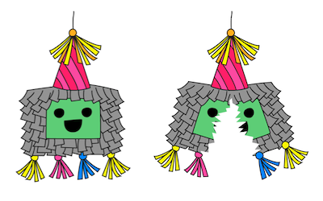

## Start the party

<div style="display: flex; flex-wrap: wrap">
<div style="flex-basis: 200px; flex-grow: 1; margin-right: 15px;">
In this step, you will choose a piñata costume and code the piñata to swing.
</div>
<div>
{:width="300px"}
</div>
</div>

--- task ---

Open the [Party piñata starter project](https://scratch.mit.edu/projects/653082997/editor){:target="_blank"}. Scratch will open in another browser tab.

[[[working-offline]]]

--- /task ---

The Scratch editor looks like this:


The **Stage** is where your project runs and a **backdrop** changes the way that the Stage looks. A Code Club party backdrop has been added for you. 

In Scratch, characters and objects are called **sprites**, and they appear on the Stage. You can see the Piñata and Stick sprites on the Stage.


At the moment there is not much happening at this party. You can change that! 

--- task ---

A sprite can have code, costumes, and sounds to change the way that it looks and what it does.

Click on the **Piñata** sprite in the Sprite list and select the **Costumes** tab. There are two piñata costumes one named 'whole' and the other named 'broken'. 




--- /task ---

--- task ---

Click on the **Code** tab. Go to the `Looks`{:class="block3looks"} blocks menu then drag a `switch costume to`{:class="block3looks"} block to the Code area. 

Click on the costume name to open a drop-down menu then select the 'whole' costume:


```blocks3
switch costume to (whole v) 
```


--- /task ---

Blocks can be connected together in the Code area to run more than one at a time. Connected blocks will run in order from top to bottom.

--- task ---

Drag a `When flag clicked`{:class="block3events"} block from the `Events`{:class="block3events"} blocks menu and connect it to the top of your looks block in the Code area. The blocks will snap together:


```blocks3
+ when flag clicked
switch costume to (whole v)
```


--- /task ---

The starting position of a piñata is always the same, it only starts moving when the piñata game is ready to play. 

--- task ---

In the `Motion`{:class="block3motion"} blocks menu, find the `go to x: 0 y: 180`{:class="block3motion"} and  `point in direction 90`{:class="block3motion"} blocks. Drag the blocks to the Code area and connect them to the bottom of your code:


```blocks3
when flag clicked
switch costume to (whole v)
+ go to x: (0) y: (180)
+ point in direction (90) // Ready position
```

--- /task ---

A `forever`{:class="block3control"} loop runs the code blocks inside it again and again. It is the perfect loop for a swinging piñata that is hard to hit.

--- task ---

Drag a `forever`{:class="block3control"} block from the `Control`{:class="block3control"} blocks menu and connect it to the bottom of your code:


```blocks3
when flag clicked
switch costume to (whole v)
go to x: (0) y: (180)
point in direction (90)
+ forever
```

--- /task ---

A `repeat`{:class="block3control"} loop can be used to make the **Piñata** sprite repeat a small movement many times. This will make the piñata appear animated.

--- task ---

Drag a `repeat 10`{:class="block3control"} block into the Code area and attach it inside your `forever`{:class="block3control"} loop. 

Go to the `Motion`{:class="block3motion"} blocks menu and drag a `turn clockwise 15 degrees`{:class="block3motion"} block into the `repeat`{:class="block3control"} block. 

Change the `15`{:class="block3motion"} degrees to `1`{:class="block3motion"} degree so that the piñata only swings a small amount each time:


```blocks3
when flag clicked
switch costume to (whole v)
go to x: (0) y: (180)
point in direction (90)
forever
+ repeat (10) 
turn right (1) degrees // change to 1
```


--- /task ---

--- task ---

**Test:** Run your project, by clicking on the **Green flag** above the stage, to see the piñata swing. 

Mmm, something is not quite right! When an object is hung from the ceiling, it won't just rotate in one direction, it will swing back and forth. 

Stop your project by clicking on the **red stop icon** above the stage.


--- /task ---

--- task ---

Add code to your `forever`{:class="block3control"} loop so that the piñata swings from the centre back and forth continuously:


```blocks3
when flag clicked
switch costume to (whole v)
go to x: (0) y: (180)
point in direction (90)
forever
repeat (10)
turn right (1) degrees 
end
+ repeat (20) // change to 20
turn left (1) degrees // change to 1
end
+ repeat (10) // change to 10
turn right (1) degrees // change to 1
end
```

--- /task ---

--- task ---

**Test:** Run your project to see the piñata swing to the left and right. 

**Debug:** If the piñata does not swing correctly: 
+ look at your code to make sure the `repeat`{:class="block3control"} blocks are in the correct position
+ check that the `turn anticlockwise`{:class="block3motion"} and `turn clockwise`{:class="block3motion"} arrows are correct
+ make sure that you have used the numbers from the code above


--- /task ---

--- save ---

